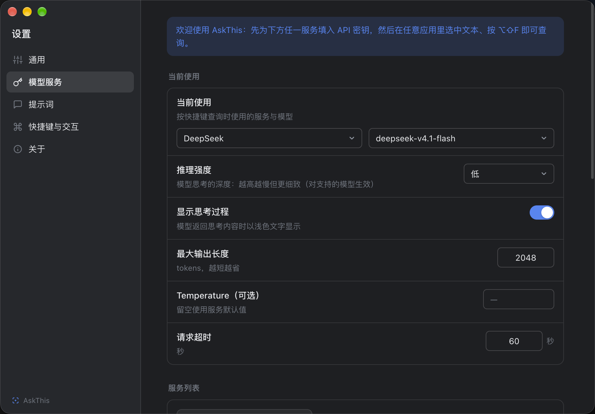
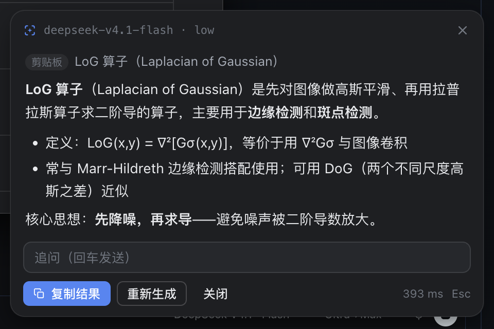

# AskThis 新手教程（零基础版）

> 不用懂编程。跟着做完这几步，10 分钟内就能用上。

## 1. 这是什么？

AskThis 是一个"**选中即问**"的小工具：在**任何软件**里选中一段文字，按一个快捷键，它就在旁边弹出一张小卡片，用 AI 给你解释、翻译或回答，还能继续追问。

几个真实场景：

- 网页上看到不认识的词（比如 "LoG 算子"）→ 选中 → 按快捷键 → 立刻看懂
- 英文邮件/论文看不懂 → 选中 → 按快捷键 → 直接出中文翻译
- 一段代码不明白 → 选中 → 按快捷键 → 逐行解释
- 想随手问个问题 → 不选任何东西，按快捷键直接打字提问

它不绑定任何一家 AI：你用自己的 AI 服务账号（推荐 DeepSeek，注册简单、便宜），AskThis 只负责把问题送过去、把答案漂亮地显示出来。

## 2. 安装

### Mac

1. 到 [Releases 页面](https://github.com/537Lab/askthis/releases) 下载：
   - Apple 芯片（M1/M2/M3/M4…）→ `AskThis-0.1.0-arm64.dmg`
   - Intel 芯片（2020 年前的 Mac）→ `AskThis-0.1.0-x64.dmg`
2. 双击打开下载的 dmg，把 **AskThis 拖进「应用程序」文件夹**
3. 第一次打开：在「应用程序」里 **右键点 AskThis → 选「打开」→ 再点一次「打开」**
   （AskThis 是免费开源软件、没有购买苹果的签名证书，所以第一次需要这样操作一下；以后正常双击即可）
4. 打开后它会**安静地待在屏幕右上角的菜单栏**（一个小图标），并自动弹出设置窗口

### Windows

1. 下载 `AskThis-0.1.0-setup-x64.exe`
2. 双击安装。如果出现蓝色 "Windows 已保护你的电脑" 提示：
   点「**更多信息**」→「**仍要运行**」（同样是未签名开源软件的正常提示）
3. 安装完成后 AskThis 会启动，待在**任务栏右下角（托盘）**，并自动弹出设置窗口

## 3. 最关键的一步：配置 AI 服务（获取 API 密钥）

AskThis 本身不含 AI 能力，需要你提供一个 AI 服务的"钥匙"（**API 密钥**）。
**推荐 DeepSeek**：国内直接可用、注册简单、几块钱能用很久。

<b>点这里展开：以 DeepSeek 为例，获取 API 密钥</b>

1. 打开 <https://platform.deepseek.com>，注册并登录
2. 左侧菜单点「**充值**」：充几元即可（例如 10 元，够用很久）
3. 左侧菜单点「**API keys**」→「**创建 API key**」
4. 名字随便填（比如 askthis）→ 创建后**立刻复制**生成的密钥
   （形如 `sk-xxxxxxxx`，**只显示这一次**，请马上复制）
5. 回到 AskThis 的设置窗口 →「**模型服务**」页：
   - 左侧已经预置了 **DeepSeek**，点击它
   - 把密钥**粘贴**到「API 密钥」输入框 → 点「保存」
   - 点「**获取模型列表**」→ 从下拉框选一个模型（如 `DeepSeek-V4.1-Flash`）
6. 完成！现在可以去第 4 步使用了

<b>用其他 AI 服务？</b>

如果你已经买了其他服务（OpenAI、Claude、Kimi、智谱、硅基流动等）：

- 到对应服务商的后台找到「API Keys / 密钥管理」页面，创建并复制密钥
- 在 AskThis 设置 →「模型服务」→「添加服务」里选择对应服务，粘贴密钥即可
- 服务商不在列表里？选「Custom (OpenAI-compatible)」，填入服务商文档里给出的 API 地址

## 4. 第一次使用

1. （仅 Mac 需要）第一次按快捷键时，系统会提示需要「**辅助功能**」权限——
   这是为了让 AskThis 能"看到"你选中的文字：
   - 点「授权…」→ 在打开的"系统设置"里勾选 **AskThis**
   - 回到 AskThis，点「**重启 AskThis**」按钮（重要：授权后需要重启才生效）
2. 随便打开一个网页或文档，**选中一段文字**
3. 按快捷键：
   - Mac：**⌥⇧D**（Option + Shift + D）
   - Windows：**Alt + Shift + D**
4. 小卡片弹出，稍等几秒，答案就出来了

## 5. 日常操作

| 想做的事 | 怎么做 |
| --- | --- |
| 查一个词 / 一段话 | 选中 → 按快捷键 |
| 直接提问 | 不选中任何东西 → 按快捷键 → 直接打字 → 回车 |
| 继续追问 | 在卡片底部输入框打字 → 回车 |
| 复制答案 | 点「复制结果」（复制后卡片自动关闭） |
| 关掉卡片 | 按 `Esc`，或点「关闭」 |
| 换个模型 / 服务 | 设置 →「模型服务」 |
| 换个快捷键 | 设置 →「快捷键与交互」 |
| 换界面语言 / 主题 | 设置 →「通用」 |

## 6. 常见问题

**Q：按快捷键没反应？**

- 可能被其他软件占用了这个键 → 设置 →「快捷键与交互」→ 换一个组合
- Mac：检查「系统设置 → 隐私与安全性 → 辅助功能」里 AskThis 是否已勾选；勾选后点设置页里的「重启 AskThis」

**Q：提示"请求失败 / 超时"？**

- 检查网络；如果你使用代理软件，请打开它的"**系统代理**"模式（AskThis 自动跟随系统代理）
- 检查 API 密钥是否填对、AI 服务账户里是否有余额

**Q：卡片里显示"尚未配置 API 密钥"？**

- 回到第 3 步，在设置里把密钥填好

**Q：会花很多钱吗？**

- 每次查询通常花不到几分钱；DeepSeek 充 10 元能用很久
- 想更省：设置 →「模型服务」→ 把「最大输出长度」调小

**Q：我的文字会被发到哪里？**

- 只发送到**你自己配置的 AI 服务**（如 DeepSeek）。AskThis 不收集任何数据、没有账号系统、没有遥测

**Q：窗口找不到了？**

- AskThis 平时没有主窗口（这是刻意的，不占屏幕）：
  - Mac：看屏幕右上角**菜单栏的小图标**，点击它有菜单
  - Windows：看任务栏右下角**托盘区的小图标**
- 或者直接按快捷键，速查卡片就会出来

---

遇到本教程没覆盖的问题？欢迎到 [Issues](https://github.com/537Lab/askthis/issues) 提问。
